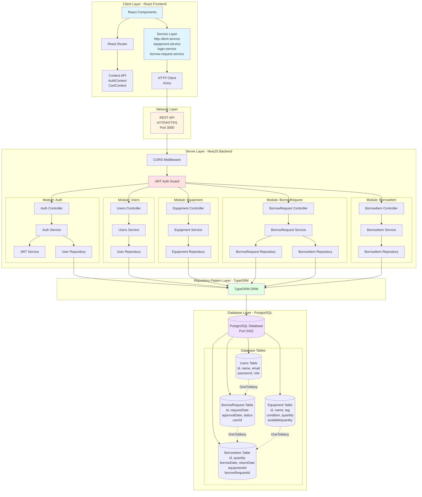
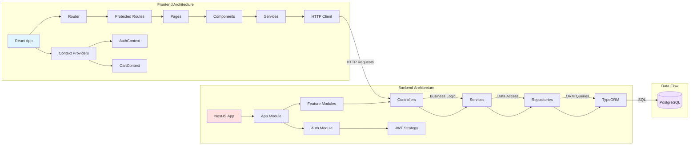
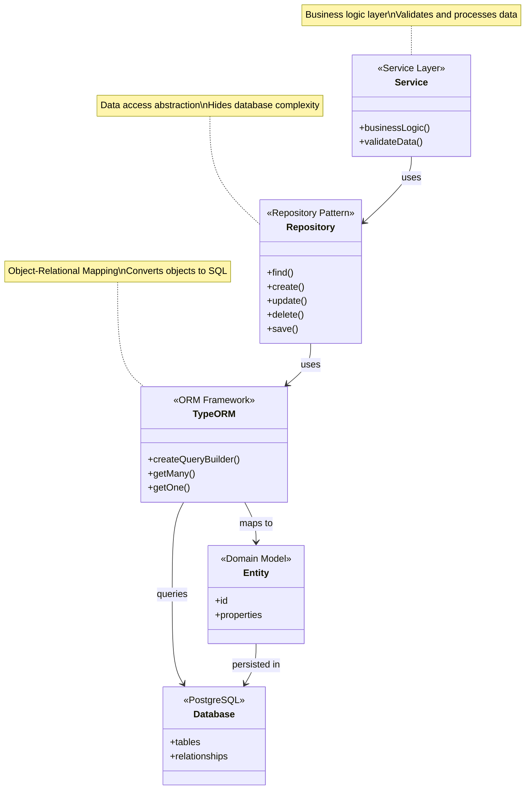
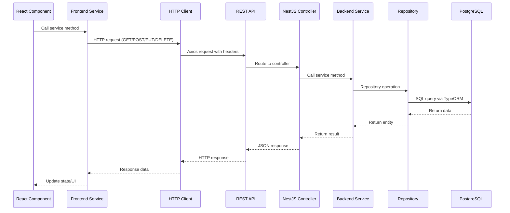
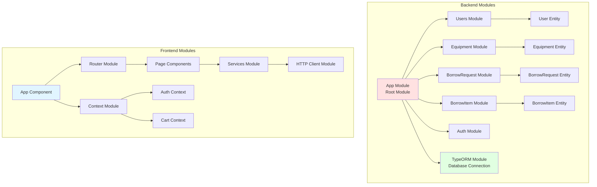
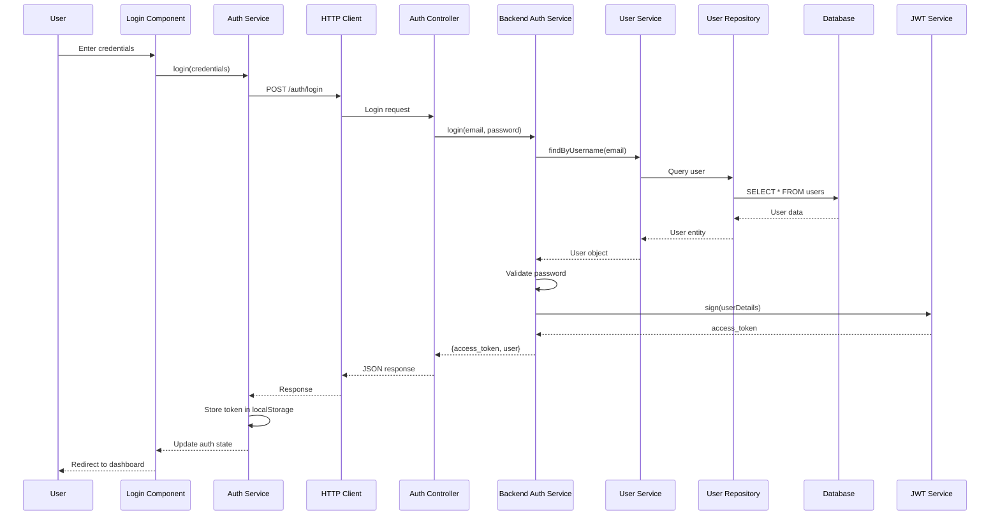
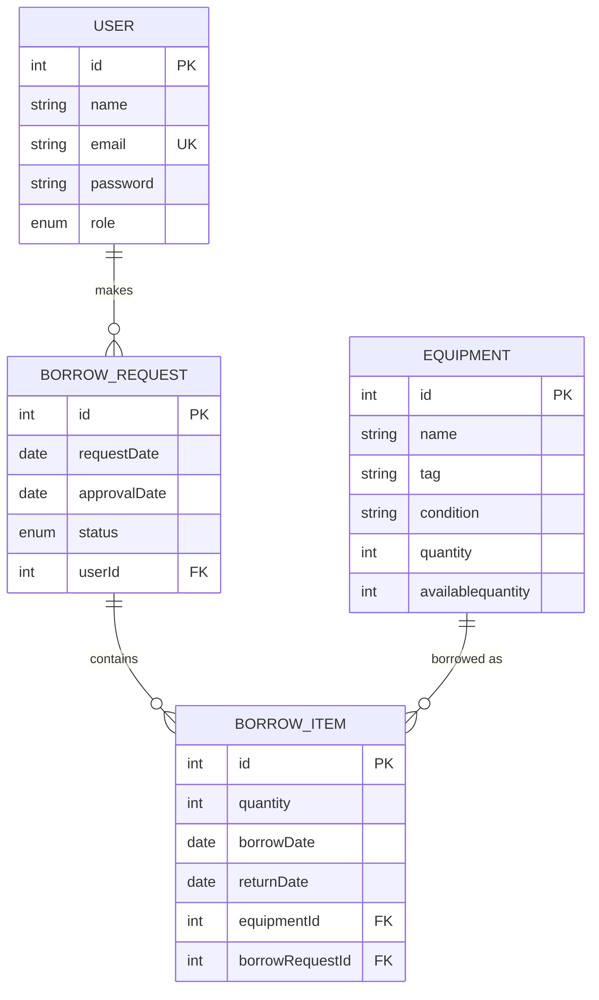

# System Architecture Diagram

## Overview
This document contains the architecture diagram for the Inventory Management System, showing the Client-Server pattern, Repository pattern, and Database structure.

## Architecture Diagram

## Detailed Component Architecture

## Repository Pattern Detail

## Client-Server Communication Flow

## Module Structure

## Authentication Flow

## Database Schema Relationships

## Technology Stack

### Frontend
- **Framework**: React 19.0.0
- **Build Tool**: Vite 6.1.0
- **Routing**: React Router 7.1.5
- **HTTP Client**: Axios 1.12.2
- **UI Framework**: Bootstrap 5.3.8
- **State Management**: React Context API

### Backend
- **Framework**: NestJS 11.0.1
- **Language**: TypeScript 5.7.3
- **ORM**: TypeORM 0.3.27
- **Database**: PostgreSQL (via pg 8.16.3)
- **Authentication**: JWT (Passport JWT 4.0.1)
- **Password Hashing**: bcrypt 6.0.0

### Database
- **RDBMS**: PostgreSQL
- **Port**: 5432
- **Database Name**: inventory

## Key Design Patterns Identified

1. **Repository Pattern**: TypeORM repositories abstract database access
2. **Client-Server Pattern**: React frontend communicates with NestJS backend via REST API
3. **Module Pattern**: NestJS modular architecture with feature modules
4. **MVC Pattern**: Controllers handle requests, Services contain business logic, Repositories handle data access
5. **Dependency Injection**: NestJS uses DI for services and repositories
6. **Context Pattern**: React Context API for global state management
7. **Service Layer Pattern**: Frontend services abstract API communication

